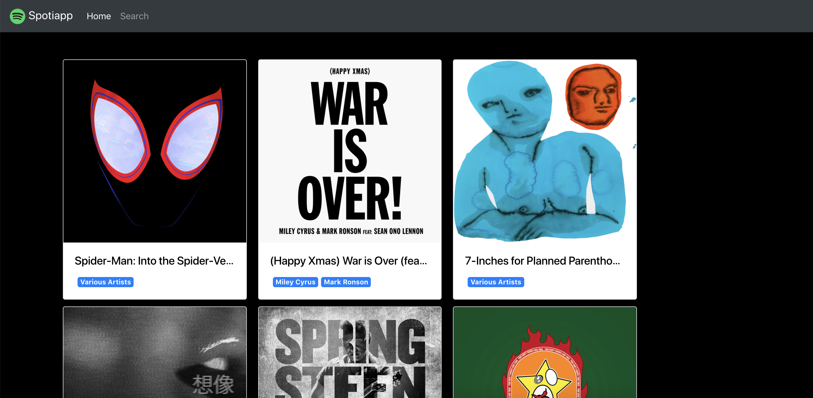
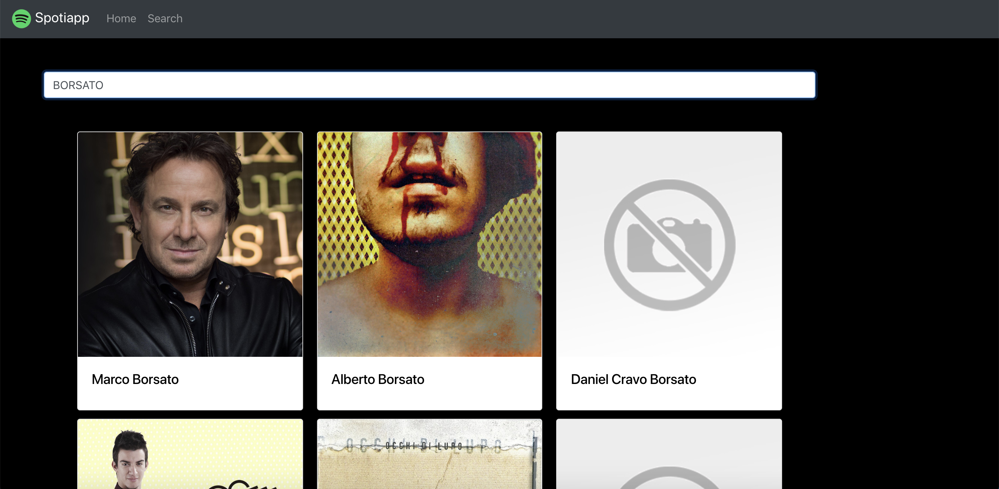
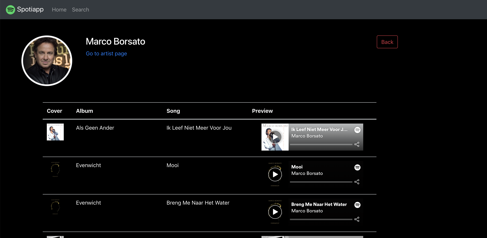

# spotiapp
Angular 7 app using Spotify Developers API

## Steps
1. Resources provided for the app have been added to the resources folder.
2. Create a new Angular app:
```javascript
ng new spotiapp
```
3. Create a new app in Spotify:

    * Open https://developer.spotify.com/dashboard in your browser
    * Login or sign-up
    * Click in button **Create a client ID**
        - Step 1
            * App or Hardware Name = **spotiapp**
            * App or Hardware Description = **Spotify Training App**
            * What are you building = **Website**
            * Click **Next** button.
        - Step 2
            * Are you developing a commercial integration? = **No**
        - Step 3
            * Check all the checkboxes.
            * Click **Submit** button

    Once you have finished the creation process, you are presented with the details of your new app. From this page you have to store in a save place two things:

    * Client ID
    * Client Secret

    These two hashes will be needed to interact with the Spotify REST API.
4. Execute the application:

    * Change directory to the root of the app
    ```bash
    cd spotiapp
    ```
    * Open up the server:
    There are two different commands you can use to run the server to serve your application.

        1. Using **angular-cli**
            ```bash
            ng serve
            ```
        2. Using **npm**
            ```bash
            npm start
            ```

        Both commands will run your application.
        Once the compilation is finished and the server is running you can open the server url in your browser. http://localhost:4200

5. Mock-ups of our app.
    - Home
    

    - Search
     

    - Artist
     

6. Create page components:

    * Open terminal.
    * Change directory to the root of the app
    ```bash
    cd spotiapp
    ```
    #### HOME PAGE COMPONENT 
    * Create HOME component
        * Component only
        ```bash
        ng g c components/home --spec=false -is
        ```
        * Component + Tests only
        ```bash
        ng g c components/home -is
        ```
        * Component + Tests + Styles
        ```bash
        ng g c components/home
        ```
    * Check ```spoti-app/spotiapp/src/app/app.module.ts``` has been updated adding home component.
    #### SEARCH PAGE COMPONENT
    * Create SEARCH component
        * Component only
        ```bash
        ng g c components/search --spec=false -is
        ```
        * Component + Tests only
        ```bash
        ng g c components/search -is
        ```
        * Component + Tests + Styles
        ```bash
        ng g c components/search
        ```
    * Check ```spoti-app/spotiapp/src/app/app.module.ts``` has been updated adding search component.
    #### ARTIST PAGE COMPONENT
    * Create ARTIST component
        * Component only
        ```bash
        ng g c components/artist --spec=false -is
        ```
        * Component + Tests only
        ```bash
        ng g c components/artist -is
        ```
        * Component + Tests + Styles
        ```bash
        ng g c components/artist
        ```
    * Check ```spoti-app/spotiapp/src/app/app.module.ts``` has been updated adding artist component.
    #### COMMON NAVIGATION COMPONENT
    * Create Navigation component
        * Component only
        ```bash
        ng g c components/shared/navbar --spec=false -is
        ```
        * Component + Tests only
        ```bash
        ng g c components/shared/navbar -is
        ```
        * Component + Tests + Styles
        ```bash
        ng g c components/shared/navbar
        ```
    * Check ```spoti-app/spotiapp/src/app/app.module.ts``` has been updated adding navigation component.

7. Allocate the resources were they will be used.

    * Copy ```spoti-app/resources/img``` to ```spoti-app/spotiapp/src/assets```
    * Replace ```spoti-app/spotiapp/src/styles.css``` with ```spoti-app/resources/styles.css```

8. Add Bootstrap 4 to our project.

    * Open [Bootstrap CDN](https://getbootstrap.com/docs/4.1/getting-started/download/#bootstrapcdn) in your browser.
    * Open ```spoti-app/spotiapp/src/index.html```
    * Copy the following snippet at the end of **head** node.
        ```html
        <link rel="stylesheet" href="https://stackpath.bootstrapcdn.com/bootstrap/4.1.3/css/bootstrap.min.css" integrity="sha384-MCw98/SFnGE8fJT3GXwEOngsV7Zt27NXFoaoApmYm81iuXoPkFOJwJ8ERdknLPMO" crossorigin="anonymous">
        ```
    * Copy the following snippet at the end of **body** node.
        ```html
        <script src="https://code.jquery.com/jquery-3.3.1.slim.min.js" integrity="sha384-q8i/X+965DzO0rT7abK41JStQIAqVgRVzpbzo5smXKp4YfRvH+8abtTE1Pi6jizo" crossorigin="anonymous"></script>
        <script src="https://cdnjs.cloudflare.com/ajax/libs/popper.js/1.14.3/umd/popper.min.js" integrity="sha384-ZMP7rVo3mIykV+2+9J3UJ46jBk0WLaUAdn689aCwoqbBJiSnjAK/l8WvCWPIPm49" crossorigin="anonymous"></script>
        <script src="https://stackpath.bootstrapcdn.com/bootstrap/4.1.3/js/bootstrap.min.js" integrity="sha384-ChfqqxuZUCnJSK3+MXmPNIyE6ZbWh2IMqE241rYiqJxyMiZ6OW/JmZQ5stwEULTy" crossorigin="anonymous"></script>
        ```

9. Creating app routes:

    * Open file ```spoti-app/spotiapp/src/app/app-routing.module.ts```
    * Add configuration to use hash in the url
        ```typescript
        @NgModule({
            imports: [RouterModule.forRoot(routes, { useHash: true })],
            exports: [RouterModule]
        })
        ```
    #### Home Page Route:
    * After the existing imports add the following code.
        ```typescript
        import { HomeComponent } from './components/home/home.component';
        ```
    * Add the route path in the array **routes**
        ```typescript
        const routes: Routes = [
            { path: 'home', component: HomeComponent}
        ];
        ```
    #### Search Page Route:
    * After the existing imports add the following code.
        ```typescript
        import { SearchComponent } from './components/search/search.component';
        ```
    * Add the route path in the array **routes**
        ```typescript
        const routes: Routes = [
            { path: 'home', component: HomeComponent},
            { path: 'search', component: SearchComponent}
        ];
        ```
    #### Wildcards Routes:
    * Add the route path in the array **routes**
        ```typescript
        const routes: Routes = [
            { path: 'home', component: HomeComponent},
            { path: 'search', component: SearchComponent},
            { path: '', pathMatch: 'full', redirectTo: 'home'},
            { path: '**', pathMatch: 'full', redirectTo: 'home'}
        ];
        ```
10. Creating the basic layout:

    * Open ```spoti-app/spotiapp/src/app/app.component.html``` and remove all its content.
    #### Adding navigation:
    * Insert the following code:
        ```html
        <app-navbar></app-navbar>
        
        <div class="container">
            <router-outlet></router-outlet>
        </div>
        ```
    * Open ```http://localhost:4200``` in your browser and check how routing is working.

11. Making changes in navigation bar:

    * Open ```spoti-app/spotiapp/src/app/components/shared/navbar/navbar.component.html``` and remove all its content.
    * Open [Navbar Bootstrap](https://getbootstrap.com/docs/4.1/components/navbar/#supported-content)
    * Copy the content of the first code snippet in ```spoti-app/spotiapp/src/app/components/shared/navbar/navbar.component.html```
    * See how it is shown in the app.
    #### Tweaking and cleaning up navbar.
    * We need to do some cleaning up in this markup, so replace it by the following code:
        ```html
        <nav class="navbar navbar-expand-md navbar-dark bg-dark">
            <a class="navbar-brand" href="#">
                 Spotiapp
            </a>
            <button class="navbar-toggler" type="button" data-toggle="collapse" data-target="#navbarSupportedContent" aria-controls="navbarSupportedContent" aria-expanded="false" aria-label="Toggle navigation">
                <span class="navbar-toggler-icon"></span>
            </button>

            <div class="collapse navbar-collapse" id="navbarSupportedContent">
                <ul class="navbar-nav mr-auto">
                    <li class="nav-item" routerLinkActive="active">
                        <a class="nav-link" routerLink="home">Home</a>
                    </li>
                    <li class="nav-item">
                        <a class="nav-link" routerLink="search">Search</a>
                    </li>
                </ul>
            </div>
        </nav>
        ```
12. Adding space between page content and navigation bar.
    
    As you can see the page content is touching the navigation bar and this doesn't let the design to breath. To solve this we have to add some space between both.

    * Open ```spoti-app/spotiapp/src/app/app.component.html``` and add a class to add some margin as you can see in the next piece of code.
        ```html
        <app-navbar></app-navbar>

        <div class="container m-5">
            <router-outlet></router-outlet>
        </div>
        ```
13. Start working with services:

    #### Creating Spotify service:
    * Create our first service:
        ```bash
        ng g s services/spotify --spec=false
        ```
    * For this exercise we are going to use a public api to fetch what countries speak Dutch. 
        * [REST Countries](https://restcountries.eu/)
        * https://restcountries.eu/rest/v2/lang/nl
    * In order to make it work we need to add some code to our service.
        ```typescript
        import { Injectable } from '@angular/core';
        import { HttpClient } from '@angular/common/http'; // < added

        @Injectable({
        providedIn: 'root'
        })
        export class SpotifyService {

            constructor(private http: HttpClient) {} // < added

            getCountriesSpeakingDutch() { // < added
                return this.http
                .get(`https://restcountries.eu/rest/v2/lang/nl`)
            }
        }
        ```
    #### Adding HttpClientModule and service to app module:
    * Open ```spoti-app/spotiapp/src/app/app.module.ts``` and after the last import add the following:
        ```typescript
        import { HttpClientModule } from '@angular/common/http';
        ```
    * Add module to NgModule imports sections
        ```typescript
        @NgModule({
            declarations: [
                AppComponent,
                HomeComponent,
                ArtistComponent,
                NavbarComponent,
                SearchComponent
            ],
            imports: [
                BrowserModule,
                AppRoutingModule,
                HttpClientModule // < Add module here
            ],
            providers: [ ]
            bootstrap: [AppComponent]
            })
        ```
    #### Use service from Home Component:
    * Open ```spoti-app/spotiapp/src/app/components/home/home.component.ts```
    * Add some code to get data from REST API.
        * Component file:
            ```typescript
            import { Component, OnInit } from '@angular/core';
            import { SpotifyService } from '../../services/spotify.service'; // < added

            @Component({
            selector: 'app-home',
            templateUrl: './home.component.html',
            styles: []
            })
            export class HomeComponent implements OnInit {

            countries: any[] = [];  // < added

            constructor(private spotifyService: SpotifyService) { } // < added

            ngOnInit() {
                this.spotifyService             // < added
                .getCountriesSpeakingDutch()
                .subscribe((response: any[]) => {
                    this.countries = response;
                });
            }

            }
            ```
        * HTML file:
            ```typescript 
            <ul>
                <li *ngFor="let country of countries">
                    {{ country.name }}
                </li>
            </ul>
            ```
    
14. Removing demo service method and usage.

    * Open ```spoti-app/spotiapp/src/app/services/spotify.service.ts``` and remove **getCountriesSpeakingDutch** method.
    * Open ```spoti-app/spotiapp/src/app/components/home/home.component.html``` and remove the **ul** and children.
    * Open
    ```spoti-app/spotiapp/src/app/components/home/home.component.ts``` and...
        * Remove the code inside **ngOnInit** 
        * Remove **countries** property

15. Setting up our service to get the Spotify JWT Token on each request:

    Our application will use Spotify JWT Token and as we have created our app in Spotify Developers page now it's time to set it up.

    * Clone the repo:
        ```bash
        git clone https://github.com/tcorral/spotify-get-token.git
        ```
    * Run server:

        ```bash
        npm start
        ```
        The server will listen in port 3000 and the url to get the token is:
            * ```http://localhost:3000/spotify/:client_id/:client_secret``` 
            * It will require you to provide your client id and the client secret.
        
        #### Example:
        http://localhost:3000/spotify/f7d4864e23544f919f3d5552e2a88478/6666625842324f1ca4e1e2ef81387e46
    

        

